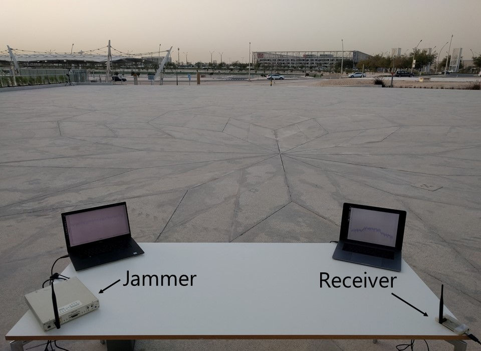
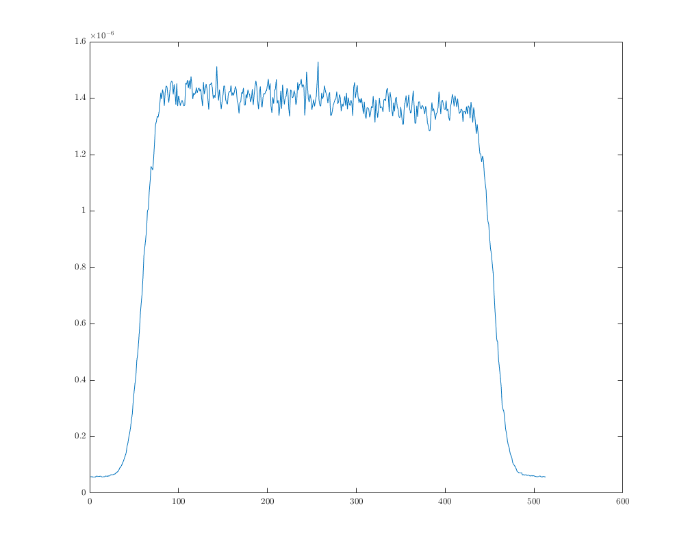

# Modeling a Communication Channel under Jamming - Theory and Applications

The data acquired from the wireless communication channel during our experimental campaign have been also released open-source, to allow researchers and Industry to verify our findings, and to further validate the effectiveness of their methods on real outdoor channel conditions.

We conducted a large experimental campaign, by acquiring real jamming signals outdoor on three different reference channels (500.00MHz, 1,575.42MHz, and 2,437.00MHz), and we analyzed the resulting status of the channel at increasing distance from the jamming source.

To model the variation of the average Received Signal Strength (RSS) as a function of the distance d between the transmitter and the receiver, we collected a set of RSS samples for a time Tau=10 minutes for a set of different distances D = d1, d2, ..., dn in an outdoor environment without any obstacle between them, thus making it possible to average out both the slow and the fast fading. It is worth noticing that the experimental measurements are affected by the technology that we have adopted and by the environmental conditions. In all the experiments we can assume LoS between the transmitter and the receiver. Moreover, the nodes were deployed at the same height, so that we cover only the 2-D case deployment.

## Experimental Setup

All the experiments have been performed in an outdoor scenario by using two Software Defined Radios such as the Ettus Research X310 SDR, featuring a UBX160 daughterboard as a jammer transmitter, a MyriadRF LimeSDR as receiver, and a Laptop Dell XPS15 9560, equipped with 32GB of RAM and 8 Intel Core i7700HQ processors running at 2.80 GHz. We acquired the samples by adopting the GNURadio Development Toolkit on three different reference channels (500.00MHz, 1,575.42MHz, and 2,437.00MHz) by using antennas that best fit the frequency range. The antennas gains are set to the maximum for the transmitter and for the receiver in order to have the maximum effectiveness to radiate (in TX) and convert (in RX) the power into a signal.

<p align="center">
     
</p>

## Dataset

The ZIP archive file is split in six parts of 24MB each. Each folder contains the RSS samples divided by frequency (500.00MHz, 1,575.42MHz, and 2,437.00MHz) and for each one them by distances (0.5m, 1m, 1.5m, 2m, 3.5m, 5m, 10m, 15m, 20m). Each row of the file contains the RSS samples acquisition with an FFT size of 1024. As following an example on how to parse the data with Matlab (version 2020b).

```matlab
clc
clear all
format long

mis = readmatrix('500MHz/0.5/RX-dB.txt');

%% Acquired Signal
RX = 10.^(mis/10);
Rx = RX(10:end,:);
plot(mean(Rx))
```

<p align="center">
     
</p>

## Contributing
Pull requests are welcome. For major changes, please open an issue first to discuss what you would like to change.

## Disclaimer
Any actions and or activities related to the material contained within this github repository is solely your responsibility. The misuse of the information in this repository can result in criminal charges brought against the persons in question. The author(s) will not be held responsible in the event any criminal charges be brought against any individuals misusing the information in this repository to break the law.

## Authors
- Pietro Tedeschi (ptedeschi@hbku.edu.qa)
- Savio Sciancalepore (s.sciancalepore@tue.nl)
- Roberto Di Pietro (rdipietro@hbku.edu.qa)

Division of Information and Computing Technology (ICT), College of Science and Engineering (CSE) - Hamad Bin Khalifa University (HBKU), Doha, Qatar

Security Group - Faculty of Mathematics and Computer Science, Eindhoven University of Technology (TU/e), Eindhoven, The Netherlands

## License
The dataset is released under the GPL3-Clause <a href="LICENSE">license</a>.
